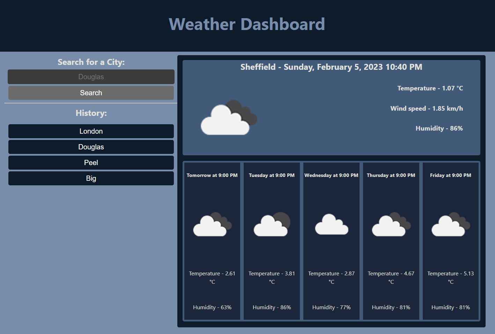

# weather-forecast
A weather forecast site, returning the weather by using an API in combination with jQuery and Ajax

## Deployment

__[Github Repository](https://github.com/jbkennaugh/weather-forecast/)__

__[Deployed Website](https://jbkennaugh.github.io/weather-forecast/)__

## Screenshots 

## License

Please refer to the LICENSE in the repository

## Credits

Credits to openweathermap.org for their free to use weather API